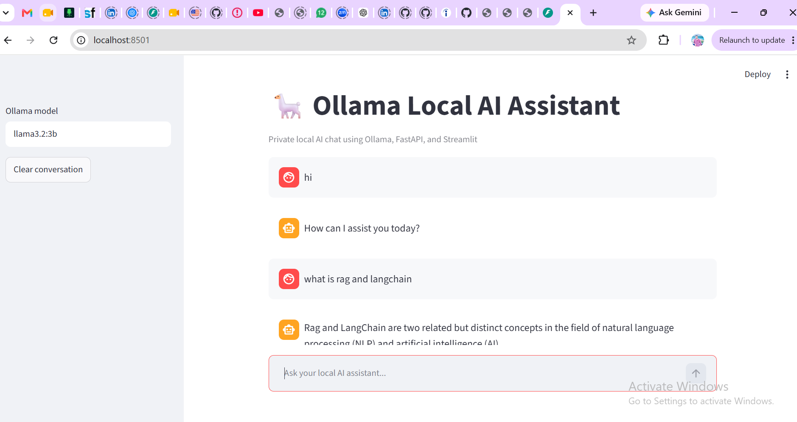
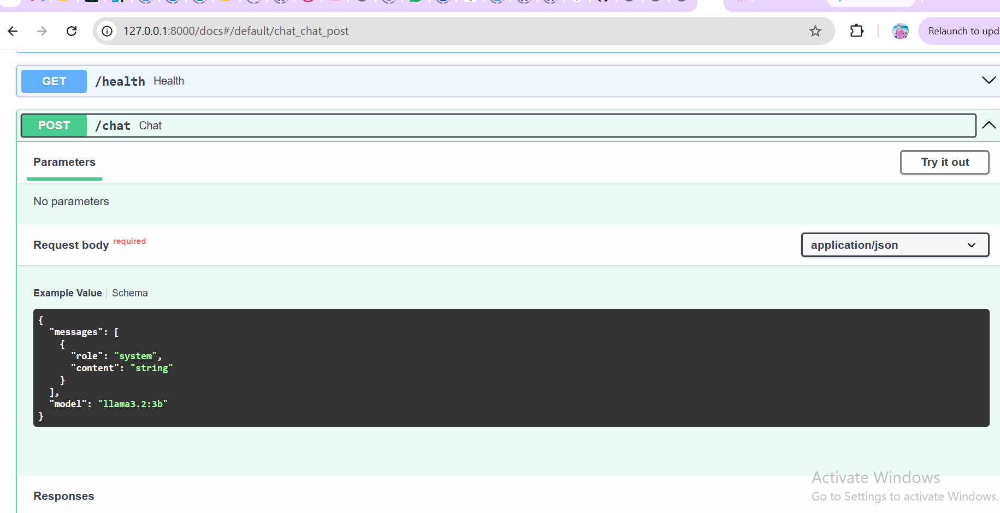
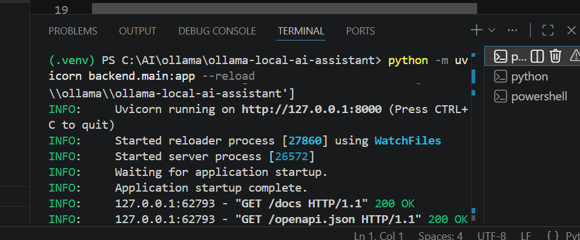
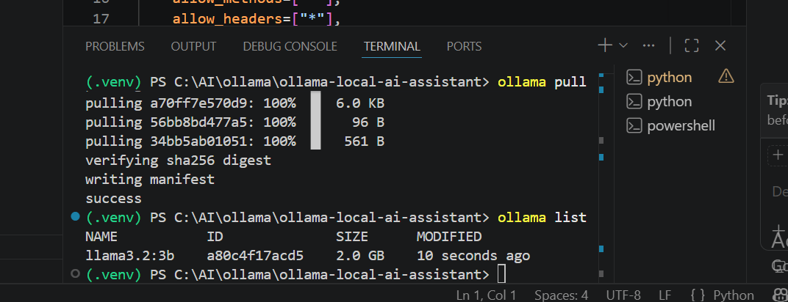

# Ollama Local AI Assistant

Privacy-focused Local AI Assistant built with Ollama, FastAPI, Streamlit, and Llama 3.2.

## Overview

Ollama Local AI Assistant is a self-hosted chat application that runs a large language model entirely on your own machine through Ollama. A FastAPI backend exposes a small REST API in front of the local model, and a Streamlit frontend provides a simple chat interface. No cloud API key is required, no conversation data leaves your computer, and the whole stack can run fully offline once the model has been downloaded.

## Project Statistics

- FastAPI REST Backend
- Streamlit Web UI
- Local LLM Integration
- Swagger Documentation
- Offline Execution
- Python 3.12 Compatible

## Features

- Local LLM chat powered by Ollama, with no paid API key required
- FastAPI backend with async REST endpoints
- Streamlit frontend with a clean chat UI
- Conversation history within a session
- Model selector to switch between pulled Ollama models
- Health check endpoint for monitoring backend and Ollama connectivity
- Auto-generated Swagger and ReDoc API documentation
- Works fully offline once a model is pulled

## Architecture

```
┌─────────────┐      HTTP (REST)      ┌──────────────┐      HTTP API      ┌─────────┐
│  Streamlit  │  ───────────────────► │   FastAPI    │ ─────────────────► │ Ollama  │
│  Frontend   │ ◄─────────────────── │   Backend    │ ◄───────────────── │ (LLM)   │
└─────────────┘                       └──────────────┘                    └─────────┘
   port 8501                             port 8000                        port 11434
```

The Streamlit frontend sends chat messages to the FastAPI backend over REST. The backend validates the request with Pydantic models and forwards it to the local Ollama server, which runs the selected Llama model and returns a completion. The response is passed back through the backend to the frontend and rendered in the chat window.

## Screenshots

| Streamlit Chat UI | Swagger API Docs |
| --- | --- |
|  |  |

| Backend Running | Ollama Models |
| --- | --- |
|  |  |

## Installation

### 1. Install Ollama

Install and open [Ollama](https://ollama.com).

### 2. Pull a model

```bash
ollama pull llama3.2:3b
```

For a smaller model:

```bash
ollama pull gemma3:1b
```

### 3. Set up Python

```bash
python -m venv .venv
.venv\Scripts\activate
python -m pip install -r requirements.txt
```

### 4. Configure environment variables

Copy `.env.example` to `.env` and adjust values if needed.

```bash
copy .env.example .env
```

## Usage

### Start the backend

```bash
.venv\Scripts\activate
python -m uvicorn backend.main:app --reload
```

API docs available at: http://127.0.0.1:8000/docs

### Start the frontend

In a second terminal:

```bash
.venv\Scripts\activate
python -m streamlit run frontend\app.py
```

App available at: http://localhost:8501

## API Endpoints

| Method | Endpoint | Description |
| --- | --- | --- |
| GET | /health | Health check |
| POST | /chat | Send a chat request |
| GET | /docs | Swagger documentation |

## Technologies

- Python 3.12
- FastAPI
- Streamlit
- Ollama
- Pydantic
- httpx
- Uvicorn
- Pytest

## Project Structure

```
ollama-local-ai-assistant/
├── backend/
│   └── main.py
├── frontend/
│   └── app.py
├── tests/
│   └── test_api.py
├── screenshots/
├── .github/
│   └── workflows/
│       └── python-ci.yml
├── .env.example
├── .gitignore
├── LICENSE
├── pytest.ini
├── requirements.txt
└── README.md
```

## Future Improvements

- Persist conversation history to disk or a database
- Add streaming responses for token-by-token output
- Add authentication for multi-user deployments
- Docker Compose setup for one-command startup
- Support for additional local model providers

## License

This project is licensed under the MIT License. See the [LICENSE](LICENSE) file for details.

## Author

Built by [Girish V](https://github.com/gireeshvuyyuru501-design).
